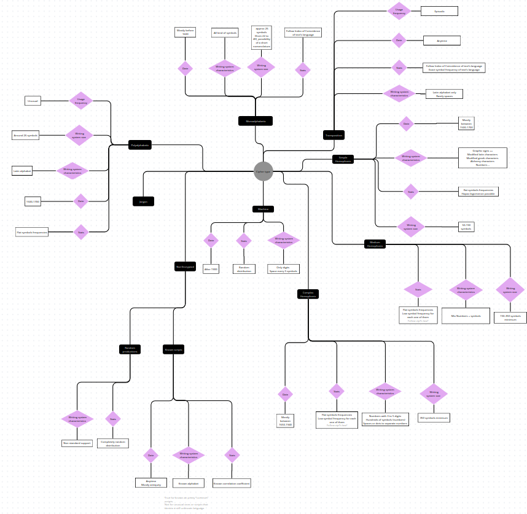

# CipherTypeFinder
June 2026

Program created for Caramba Team, Loria.

The aim of this program is to get from a raw photo of a (supposedly) ciphered manuscript, its cipher type included into 7 categories.

## Pipeline Overview

| # | Step | Status |
|---|------|--------|
| 0 | Manuscript detection (CNN) | ❌ Not implemented |
| 1 | Image & data preprocessing | ✅ Implemented (`model/preprocessing`) |
| 2 | Character clustering (convolutional autoencoder) | ✅ Implemented (`model/convolutional_autoEncoder`) |
| 3 | Computable text reconstruction | ✅ Implemented (`model/txt_equivalent_builder`) |
| 4 | Cipher type classification (feature vectors + neural network) | Architecture defined, not yet trained end-to-end |

---

## 0. Manuscript Detection *(not implemented yet)*

Before any cipher-type analysis, a first CNN should decide whether a raw input image actually looks like a manuscript at all. Any image that is **not** manuscript-like should be routed directly into the "Not encrypted / not a manuscript" output class, without going through the rest of the pipeline.

---

## 1. Preprocessing (`model/preprocessing`)

Once an image is confirmed to be a manuscript, it goes through the preprocessing pipeline, orchestrated end-to-end by `main_preprocessing.py`. The overall approach is adapted from https://dspace.ut.ee/server/api/core/bitstreams/e8c1cae6-cc96-43e8-993b-0f4f29f5312d/content.

1. **Binarization** (`binarize.py`) — converts the grayscale scan to black & white text. Six interchangeable methods are available (Otsu, Gaussian-Otsu, Adaptive, Niblack, Sauvola, Local min/max), selectable at runtime, with Sauvola as the default.
2. **Line segmentation** (`line_segmentation.py`) — computes a horizontal projection profile of the binarized page to detect text-line peaks, assigns each connected component to its nearest line, and reconstructs/saves each text line as its own image.
3. **Cleaning** (`cleaning.py`) — fits a linear regression through the foreground pixels of each line to estimate its baseline/middle zone, then removes connected components that touch the top/bottom border without reaching that middle zone (page artifacts, bleed-through, noise) as well as components below a minimum area.
4. **Connected component analysis** (`connected_component.py`) — extracts individual characters from each cleaned line via 8-connectivity connected components. Small components (diacritics, dots, accents) are merged into the nearest horizontally-aligned main glyph so composite characters stay intact. Each resulting character is saved as its own cropped image, with bounding-box visualizations kept for inspection.
5. **Processing for clustering** (`processing_for_clustering.py`) — resizes every extracted character to a fixed 100×100 canvas (aspect-ratio preserved, white-padded) and stacks the whole set into a single `.npy` array, ready to feed the autoencoder.

This produces:
- **Document characters**: individual character images
---

## 2. Character Clustering (`model/convolutional_autoEncoder`)

Implements the character-clustering approach described in *"Unsupervised Feature Learning via Convolutional Autoencoders for Cross-Manuscript Comparison in Historical Cryptanalysis"* (Alejandra Reinares, Giuseppe De Gregorio, Alicia Fornés). A cluster groups together all the characters across the corpus that look alike (i.e. are likely the same underlying glyph/symbol).

`hierarchical_silhouette_bucle.py`:

1. Loads the 100×100 preprocessed character images produced by the preprocessing step.
2. Trains a convolutional autoencoder (3-layer convolutional encoder down to a 64-dimensional latent vector, mirrored transposed-convolutional decoder) to reconstruct each character image (MSE loss, Adam optimizer).
3. Extracts and L2-normalizes the latent vector of every character from the trained encoder — this is the character's feature representation.
4. Searches for the optimal distance threshold for Agglomerative (ward-linkage) clustering by scanning a range of thresholds and keeping the one maximizing the silhouette score.
5. Runs the final hierarchical clustering with that threshold, then classifies each resulting cluster by size (<5 members = too small) and by average intra-cluster distance (top 20% = too high-variance), and saves the outcome under two parallel folders for comparison:
   - **`Original/`** — the straightforward classification: too-small and too-high-variance clusters are set aside as "Rejected" (`Rejected_TooSmall`, `Rejected_HighVar`), while the rest are kept as "Accepted" clusters, each ideally corresponding to a single distinct character/glyph.
   - **`Merged/`** — a lossless variant where no character is discarded: too-small clusters are kept as their own accepted cluster, and every character from a too-high-variance cluster is individually reassigned to whichever accepted cluster's centroid is closest, so all characters end up under a single `Accepted` folder.

---

## 3. Computable Text Reconstruction (`model/txt_equivalent_builder`)

Once each character has been assigned to a cluster, each manuscript document is reconstructed as a computable `.txt` equivalent: every character occurrence is replaced, in its original reading order, by a simple, easily-computable symbol representing its cluster (rather than the raw glyph image). This turns each manuscript into plain text that downstream numerical/statistical analysis can work with directly.

`txtBuilder.py`:

1. Prompts for the binarization method used upstream (defaults to Sauvola) and lists every document ID present in the corresponding original/binarized corpus folder.
2. For each document, walks the "Accepted" clusters produced by the character-clustering step and, by matching each character image's filename (`symbol_<doc>_<global_counter>`), links every character back to its document and cluster label, keeping the character's global position counter.
3. Sorts each document's characters by that position counter to restore the original reading order.
4. Writes, per document, a plain `.txt` file containing the space-separated sequence of cluster labels (`../corpus/computable/text/<doc>.txt`), plus a companion `.csv` recording each character's cluster label alongside its source image filename (`../corpus/computable/csv/<doc>.csv`) for traceability back to the glyph images.

---

## 4. Cipher Type Classification

From this point on, the logic follows the architecture below: a computable text equivalent of the manuscript (character-cluster based) plus the preprocessed image data are combined and fed into the classification model.

### 4.1 Feature Vectors

Outputs of preprocessing/clustering feed into two vector types:

- **Vector Numerical Data**, made from:
  - Character frequencies
  - Character occurrence values
  - Glyph number into the alphabet
  - (Characters per pool?)(depend of the implementation of space recognition during preprocessing)
  That were deduced from a statistic analysis computable text equivalent of the manuscript.

  These features were defined from expert knowledge represented in this ontology-like representation:

  

- **Vector Image**, made from the manuscript's image patches.

### 4.2 Neural Network Architecture

**Fusion**
=> Flatten Layer
- **TIP or MMCL — MERGE** (combine image vector and tabular vector) (arXiv:2407.07582v1 [cs.CV] 10 Jul 2024)

**Processing**
**Recurrent Neural Network**
=> Hidden Layer
- Activation function: **ReLU**

**Finalization**
=> Output layer
- Activation function: **SoftMax**
- Loss Function: **Triplet Loss**
- Backpropagation function / Optimization: **Adam**
- Evaluation metric: **Precision**

### 4.3 Output: Cipher Type (Classification)

- Not encrypted / not a manuscript
- Machine
- Homophonic
- Transposition
- Code book
- Polyalphabetic
- Simple Monoalphabetic

Each class outputs a **Probability P**. Multiple-class predictions can also be considered; experts will define a threshold to decide which predictions are acceptable.

---

---

## Data Acquisition

Input ciphered documents (`.jpg`) come from the DECODE Records Database of the DE-CRYPT Project. `model/corpus_builder/fetch_data.py` logs into the DE-CRYPT API, lists eligible records (excluding cipher type `6`, i.e. undetermined), and downloads their images and metadata (origin region/city, start year, cipher types) into a local corpus folder.