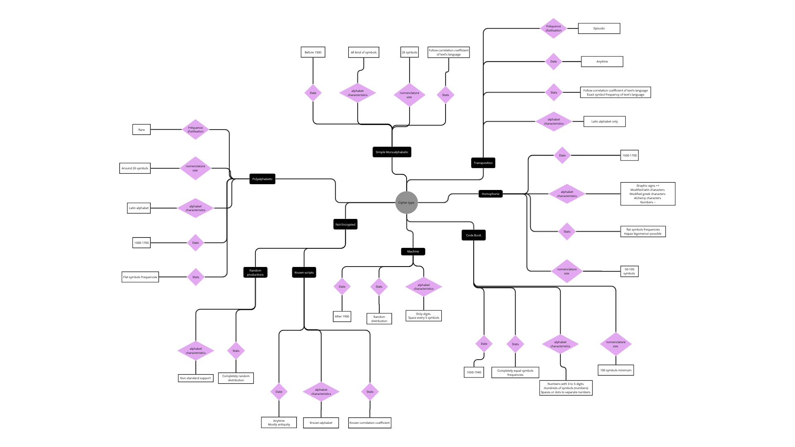

# CipherTypeFinder
June 2026

Program created for Caramba Team, Loria.

The aim of this program is to get from a raw photo of an encrypted manuscript, it's cipher type included into these 6 categories: 

# Cipher Type Finder — Architecture Schema

## 1. Input

- **Ciphered document (.jpg)** 

  DECODE Records Database from DE-CRYPT Project

## 2. Preprocessing

### 2.1 Image Preprocessing

1. **Binarization**

2. **Skew Correction**

3. **Morpho Cleaning**

4. **Linear Segmentation**

5. **Linear Noise Filtering**

   => Process extracted from https://dspace.ut.ee/server/api/core/bitstreams/e8c1cae6-cc96-43e8-993b-0f4f29f5312d/content

### 2.2 Data Preprocessing

- =>**Document lines** 

  - Space/dot based tokenization + Character/token count

- **Connected Component Analysis** → produces **Document characters**

  - Character size analysis
  - Character occurence per glyphe count (including spacing/dots)
  - Character clustering

  

------

## 3. Feature Vectors

Outputs of preprocessing feed into two vector types:

- **Vector Numerical Data**

  Made from:

  - Characters frequencies
  - Characters occurences value
  - Glyphe number into the alphabet
  - Character size variance
  - Characters per pool

  These features were definded from expert knowledge represented into this ontology like representation: 

  

- **Vector Image**

  Made from:

  - Manuscript's lines preprocessed

------

## 4. Neural Network Architecture

### Fusion

=> Flatten Layer

- **TIP or MMCL — MERGE** (combine image vector and tabular vector)

  (arXiv:2407.07582v1 [cs.CV] 10 Jul 2024)

### Processing

**Reccurent Neural Network**

=> Hidden Layer

- Activation function: **ReLU or Tanh**

### Finalization

=> Output layer

- Activation function: **SoftMax**

- Loss Function: **Categorical Cross Entropy**

- Backpropagation function / Optimization: **Adam**

- Evaluation metric: **Precision**

------

## 5. Output: Cipher Type (Classification)

- Not encrypted
- Machine
- Homophonic
- Transposition
- Code book
- Polyalphabetic
- Simple Monoalphabetic

Each class outputs a **Probability P**.

Finally, multiple classes prediction could be taken into account. Experts will define a threshold to decide which predictions are acceptable or not .

------

